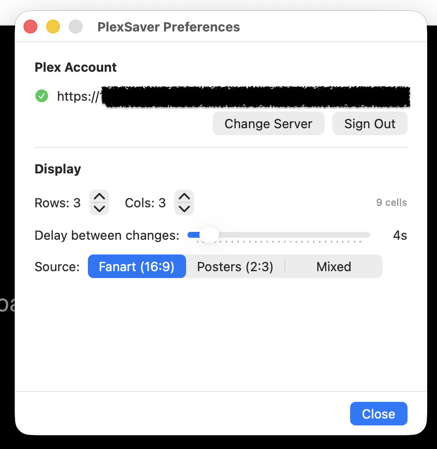

# Montage

A macOS screensaver that connects to your Plex or Jellyfin media server and displays a rotating mosaic of media artwork — the "guess the movie" experience.


## Features

- **Plex OAuth sign-in** — browser-based authentication, no manual token
- **Jellyfin support** — username/password authentication to any Jellyfin server
- **Server auto-discovery** — finds your Plex servers after sign-in
- **Configurable grid** — adjustable rows, columns, and rotation interval
- **Crossfade transitions** — smooth per-cell staggered image swaps
- **Multiple image sources** — fanart, posters, or mixed
- **Library selection** — choose which libraries to display from either provider
- **Persistent image cache** — instant startup from disk cache, no waiting
- **Offline mode** — shows cached images when server is unreachable

## Screenshots

| Screensaver | Preferences |
|:-----------:|:-----------:|
|  |  |

## Installation

### From Release

1. Download `Montage.saver.zip` from [Releases](https://github.com/jeffWelling/plex-screensaver-for-mac/releases)
2. Unzip and double-click `Montage.saver` to install
3. Open **System Settings → Screen Saver** and select Montage
4. Click **Options...** to sign in with Plex or Jellyfin and configure the grid

### Build from Source

Requires Xcode 16+ and macOS 15 (Sequoia)+.

```bash
git clone https://github.com/jeffWelling/plex-screensaver-for-mac.git
cd plex-screensaver-for-mac

# Build the screensaver bundle
xcodebuild -scheme PlexSaver -configuration Release build

# Install it
cp -R ~/Library/Developer/Xcode/DerivedData/PlexSaver-*/Build/Products/Release/PlexSaver.saver ~/Library/Screen\ Savers/Montage.saver
```

## Development

Use the **SaverTest** app target for development — it runs the screensaver in a regular window without installing it as a system screensaver:

```bash
xcodebuild -scheme SaverTest -configuration Debug build
open ~/Library/Developer/Xcode/DerivedData/PlexSaver-*/Build/Products/Debug/SaverTest.app
```

Or open `PlexSaver.xcodeproj` in Xcode, select the SaverTest scheme, and hit Run.

### Viewing Logs

```bash
log stream --predicate 'subsystem CONTAINS "montage" OR subsystem CONTAINS "Montage"' --level debug
```

## Configuration

| Setting | Default | Description |
|---------|---------|-------------|
| Grid Rows | 3 | Number of rows in the image grid |
| Grid Columns | 4 | Number of columns in the image grid |
| Rotation Interval | 5s | Seconds between image transitions per cell |
| Image Source | Fanart | Fanart (16:9 backgrounds), Posters (2:3), or Mixed |
| Provider | Plex | Plex or Jellyfin media server |
| Libraries | All | Which libraries to pull images from |

### Jellyfin Setup

Select **Jellyfin** from the provider picker in the preferences panel. Enter your server URL (e.g., `http://192.168.1.50:8096`), username, and password, then click **Connect**. The password is used only for initial authentication and is not stored — Montage saves the access token for subsequent sessions.

## How It Works

Montage uses a two-phase startup to eliminate cold-start delays:

**Phase 1 — Instant (disk cache):** On launch, the screensaver checks `~/Library/Caches/com.montage.Montage/` for previously cached images. If found, the grid is filled immediately and rotation begins while a small "Connecting..." status appears at the bottom.

**Phase 2 — Background (network):** A connection to the configured media server (Plex or Jellyfin) is established in the background. Once the image pool is filled from the network, it seamlessly takes over rotation from the cached images. New images are written through to the disk cache for next time.

If the server is unreachable and cached images exist, the screensaver continues showing them with a brief "Offline" notice. If no cache exists and no connection can be made, an error message is displayed.

### Architecture

- `ScreenSaverView` subclass with `CALayer`-based grid rendering
- Dual-layer crossfade pattern per cell (GPU-accelerated)
- `MediaProvider` protocol with `PlexProvider` and `JellyfinProvider` implementations
- Actor-based `ImagePool` with three cache tiers: in-memory → disk → network
- `DiskCache` actor with JPEG persistence, LRU eviction, and config validation
- Plex and Jellyfin APIs via async/await `URLSession`
- SwiftUI configuration sheet hosted in `NSHostingController`

## Troubleshooting

**Screensaver shows "No server configured"**
Open System Settings → Screen Saver → Montage → Options and sign in with your Plex or Jellyfin account.

**Images don't load / "Could not load media"**
Verify your media server is running and accessible from this Mac. Check that at least one library has media with artwork.

**Screensaver doesn't appear in System Settings**
Ensure `Montage.saver` is in `~/Library/Screen Savers/`. Try removing and re-adding it.

**Cache issues**
Clear the disk cache by deleting `~/Library/Caches/com.montage.Montage/`. The screensaver will rebuild it on next launch.

## License

This project is licensed under the [GNU General Public License v3.0](LICENSE).

## Created By

This project was created entirely by [Claude Code](https://claude.ai/claude-code) with Anthropic's Claude Opus 4.6.
